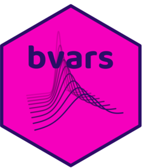

<!-- README.md is generated from README.Rmd. Please edit that file -->

# bvars <a href="https://bsvars.org/bvars/"></a>

An **R** package for Bayesian Forecasting with Large Vector
Autoregressions

<!-- badges: start -->

[](https://github.com/bsvars/bvars/actions/workflows/R-CMD-check.yaml)
<!-- badges: end -->

Provides fast and efficient procedures for Bayesian estimation and
forecasting using state-of-the-art Vector Autoregressions. This package
includes the model proposed by [Chan
(2020)](https://doi.org/10.1080/07350015.2018.1451336), that is, a
Bayesian Vector Autoregression with Minnesota priors and a flexible
structure of the error term specification. The latter includes:
conditional multivariate normal or Student’s t distributions, as well as
homoskedastic or heteroskedastic specifications with a common volatility
modelled by centred or non-centred Stochastic Volatility. Additionally,
the package facilitates predictive analyses using density forecasting
and forecast-error variance decompositions. All this is complemented by
simple workflows, useful plots and summary functions, and comprehensive
documentation. The ‘bvars’ package aligns with R packages ‘bsvars’ by
[Woźniak (2024)](https://doi.org/10.32614/CRAN.package.bsvars),
‘bsvarSIGNs’ by [Wang & Woźniak
(2025)](https://doi.org/10.32614/CRAN.package.bsvarSIGNs), and ‘bpvars’
by [Woźniak (2025)](https://doi.org/10.32614/CRAN.package.bpvars)
regarding objects, workflows, and code structure, and they constitute an
integrated toolset.

<a href="https://bsvars.org">

</a> <a href="mailto:contact@bsvars.org">

</a> <a href="https://github.com/bsvars/bpvars">

</a> <a href="https://bsky.app/profile/bsvars.org">

</a> <a href="https://fosstodon.org/@bsvars">

</a>  

<a href="https://bsvars.org/"></a>
<a href="https://bsvars.org/bsvars/"></a>
<a href="https://bsvars.org/bsvarSIGNs/"></a>
<a href="https://bsvars.org/bpvars/"></a>
<a href="https://bsvars.org/bvars/"></a>
<a href="https://bsvars.org/StealLikeBayes/"></a>

## Features

#### Forecasting with Bayesian Vector Autoregressions

- The **bvars** package includes state-of-the-art Vector Autoregressive
  models with Minnesota priors and a flexible structure of the error
  term specification. The model equations are:

<!-- -->

           Y = A X + E          (VAR equation)
       E | X ~ MN(0, O, S)      (error term normality)

- dependent variable matrix `Y`,
- lagged dependent variable matrix `X`,
- error term `E`,
- autoregressive parameter matrix `A`,
- error term covariance matrix `S`, and
- diagonal matrix `O` allowing for heteroskedasticity and non-normality
  of the error term.
- The error terms feature a zero-mean matrix-variate normal distribution
  with row-specific covariance matrix `S` and column-specific diagonal
  covariance matrix `O` of order `T`.
- The parameters `A` and `S` follow a matrix-variate normal inverse
  Wishart prior featuring characteristics of the Minnesota priors.
- The diagonal matrix `O` facilitates the following customisation of the
  error term specification:
  - conditional multivariate normal or Student’s t distributions,
  - homoskedastic or heteroskedastic specifications with a common
    volatility modelled by centred or non-centred stochastic volatility.

#### Simple workflows

- Specify the models using the `specify_bvar$new()` function
- Estimate the models using the `estimate()` method
- Predict the future using the `forecast()` method
- Compute forecast error variance decompositions using function
  `compute_variance_decompositions()`
- Use `plot()` and `summary()` methods to gain the insights into the
  core of the empirical problem.

#### Fast and efficient computations

- Extraordinary computational speed is obtained by combining
  - the application of frontier econometric and numerical techniques,
    and
  - the algorithms written in **C++**
- It combines the best of two worlds: the ease of data analysis with
  **R** and fast **C++** algorithms
- The algorithms used here are very fast. But still, Bayesian estimation
  might take a little time. Look at our beautiful **progress bar** in
  the meantime:

<!-- -->

    **************************************************|
    bvars: Forecasting with Large                     |
           Bayesian Vector Autoregressions            |
    **************************************************|
     Gibbs sampler for the BVAR model                 |
    **************************************************|
     Progress of the MCMC simulation for 1000 draws
        Every draw is saved via MCMC thinning
     Press Esc to interrupt the computations
    **************************************************|
    0%   10   20   30   40   50   60   70   80   90   100%
    [----|----|----|----|----|----|----|----|----|----|
    *************************************

## Start your Bayesian analysis of data

The beginnings are as easy as ABC:

``` r
library(bvars)                                          # load the package

spec = specify_bvar$new(                                # specify the model
  us_macro_chan,                                        # data
  p = 4,                                                # number of lags
  common_volatility = "ncSV",                           # heteroskedasticity
  distribution = "t",                                   # Student t error term
  stationary = rep(TRUE, ncol(us_macro_chan))           # Minnesota prior spec
)

burn = estimate(spec, S = 10000)                        # run the burn-in
post = estimate(burn, S = 10000)                        # estimate the model
summary(fore)                                           # estimation summary

fore = forecast(                                        # forecast the model 
  post,                                                 # estimation output
  horizon = 6                                           # forecast horizon
)

plot(fore)                                              # plot the forecasts
summary(fore)                                           # forecast summary forecasts

fevd = compute_variance_decompositions(
          post, horizon = 6)                            # compute variance decompositions
plot(fevd)                                              # plot variance decompositions
```

The **bvars** package supports a simplified workflow using the `|>`
pipe:

``` r
us_macro_chan |>                                        # data
  specify_bvar$new(p = 4) |>                            # specify the model
  estimate(S = 10000) |>                                # run the burn-in
  estimate(S = 10000) -> post                           # estimate the model

post |> forecast(horizon = 6) |> plot()                 # forecasting
post |> compute_variance_decompositions(horizon = 6) |> plot()
```

Now, you’re ready to analyse your model and forecasts!

#### The hexagonal logo

This beautiful logo can be reproduced in R using [this
file](https://github.com/bsvars/hex/blob/43e669e6680e3661c0789745342725092fadd21f/bvars/bvars.R).

<p>

</p>

<a href="https://bsvars.org/bvars/"></a>
<p>

</p>

## Resources

- a [reference manual](https://bsvars.org/extra/bvarPANELs_0.2.pdf)
- a website of the family of packages [bsvars.org](https://bsvars.org/)

## Installation

#### The first time you install the package

You must have a **cpp** compiler. Follow the instructions from [Section
1.3. by Eddelbuettel & François
(2023)](https://cran.r-project.org/package=Rcpp/vignettes/Rcpp-FAQ.pdf).
In short, for **Windows:** install
[RTools](https://CRAN.R-project.org/bin/windows/Rtools/), for **macOS:**
install [Xcode Command Line
Tools](https://www.freecodecamp.org/news/install-xcode-command-line-tools/),
and for **Linux:** install the standard development packages.

#### Once that’s done:

The newest version of the package can be installed by typing:

    install.packages("bvars")

The developer’s version of the package with the newest features can be
installed by typing:

    devtools::install_github("bsvars/bvars")

## Development

The package is under intensive development. Your help is most welcome!
Please, have a look at our
[issues](https://github.com/bsvars/bvars/issues) to learn what we’re
working on. Thank you!

## About the authors

**Rui** holds a Master’s degree in Mathematics from the University of
Melbourne, where her research focused on copula models, and a Master’s
degree in Statistics from Columbia University. She earned her Bachelor’s
degree in Mathematics and Economics from the London School of Economics
and Political Science. She is currently on a temporary break from
academia and is working in investment banking at Morgan Stanley.

**Andrés** is a Bayesian econometrician whose research focuses on causal
inference and structural, hierarchical, and mixture models. He develops
econometric methodology and computational tools in **R** for applied
econometric analysis.

<a href="mailto:aramir21@gmail.com">

</a> <a href="https://github.com/aramir21">

</a> <a href="https://orcid.org/0000-0002-0467-7903">

</a>
<a href="https://linkedin.com/in/andr%C3%A9s%EF%BB%BF%EF%BB%BF-ram%C3%ADrez-hassan-854796a">

</a> <a href="https://scholar.google.com/citations?user=N9yVHl4AAAAJ">

</a>
<a href="https://andresramirezhassan-introduction-bayesian-econometrics-gui.share.connect.posit.cloud/">

</a> <a href="https://ideas.repec.org/f/pra585.html">

</a>

**Tomasz** is a Bayesian econometrician and a Senior Lecturer at the
University of Melbourne. He develops methodology for empirical
macroeconomic analyses and programs in **R** and **C++** using **Rcpp**.

<a href="mailto:twozniak@unimelb.edu.au">

</a> <a href="https://github.com/donotdespair">

</a> <a href="https://orcid.org/0000-0003-2212-2378">

</a> <a href="https://www.linkedin.com/in/tomaszwwozniak">

</a>
<a href="https://scholar.google.com/citations?user=2uWpFrYAAAAJ&hl">

</a> <a href="https://arxiv.org/a/wozniak_t_1">

</a> <a href="https://www.researchgate.net/profile/Tomasz-Wozniak-2">

</a> <a href="https://fosstodon.org/@tomaszwozniak">

</a> <a href="https://bsky.app/profile/tomaszwozniak.bsky.social">

</a>
